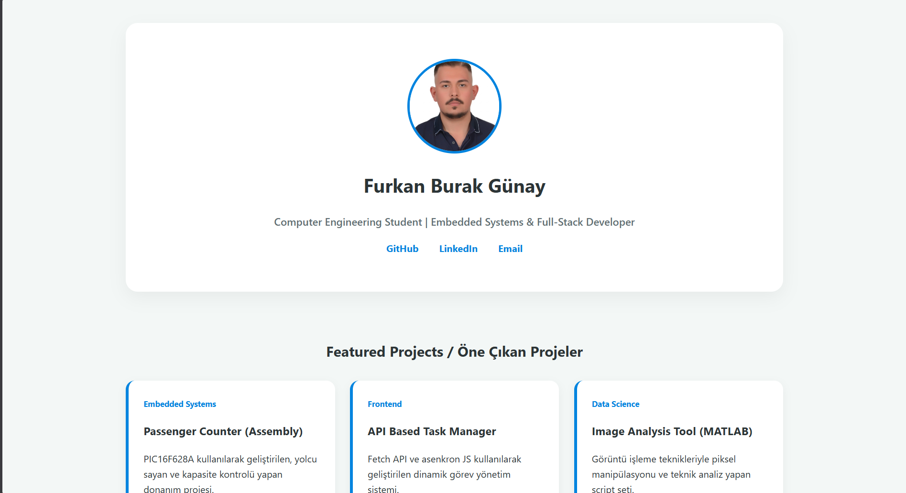

# Dynamic-FullStack-Portfolio-Engine
# 🚀 Dynamic Full-Stack Portfolio Engine / Dinamik Full-Stack Portfolyo Sistemi

[Türkçe açıklamalar için aşağı kaydırın / Scroll down for Turkish]

---

## 🇺🇸 Project Overview
This is a professional, database-driven portfolio system designed to showcase engineering projects. Unlike static sites, this engine utilizes a **Full-Stack architecture** where project data is managed via a MySQL database and served through a RESTful PHP API.

### 📋 Key Technical Features
- **Asynchronous Data Layer:** Uses the `Fetch API` to retrieve project details from the backend without reloading the page.
- **RESTful PHP Backend:** A modular PHP structure (`db.php`, `get_projects.php`) handles server-side logic and database connectivity.
- **AJAX Contact System:** Features a seamless contact form that processes user messages in the background using `FormData` and asynchronous POST requests.
- **Clean Architecture:** Strictly follows the separation of concerns by isolating **HTML (Structure)**, **CSS (Presentation)**, **JS (Logic)**, and **PHP (Data)** into independent modules.
- **Relational Database Design:** Includes a structured MySQL schema for managing both project showcases and incoming user inquiries.

### 🛠 Tech Stack
- **Frontend:** HTML5, CSS3, JavaScript (ES6+).
- **Backend:** PHP (PDO for secure database interactions).
- **Database:** MySQL.

---

## 🇹🇷 Proje Hakkında
Bu proje, mühendislik çalışmalarını sergilemek için tasarlanmış, veritabanı destekli profesyonel bir portfolyo sistemidir. Statik sitelerin aksine, bu sistem **Full-Stack bir mimari** kullanır; proje verileri MySQL veritabanında yönetilir ve RESTful PHP API üzerinden sunulur.

### 📋 Teknik Özellikler
- **Asenkron Veri Katmanı:** Sayfa yenilenmeden proje detaylarını çekmek için JavaScript `Fetch API` kullanır.
- **RESTful PHP Backend:** Sunucu taraflı mantık ve veritabanı bağlantısı için modüler PHP yapısı (`db.php`, `get_projects.php`) kullanılmıştır.
- **AJAX İletişim Sistemi:** Kullanıcı mesajlarını arka planda işleyen, `FormData` ve asenkron POST istekleri kullanan kesintisiz bir iletişim formu içerir.
- **Temiz Mimari:** Yapı (HTML), Sunum (CSS), Mantık (JS) ve Veri (PHP) katmanlarını birbirinden ayırarak "Separation of Concerns" prensibini takip eder.
- **İlişkisel Veritabanı Tasarımı:** Hem projelerin sergilenmesi hem de gelen mesajların yönetimi için yapılandırılmış MySQL şeması içerir.

### 🛠 Kullanılan Teknolojiler
- **Frontend:** HTML5, CSS3, JavaScript (ES6+).
- **Backend:** PHP (Güvenli veritabanı etkileşimi için PDO).
- **Veritabanı:** MySQL.

---

## 📸 Preview / Önizleme

## 🚀 Installation / Kurulum
1. **Database:** Import the provided SQL schema into your **MySQL** database. / Sağlanan SQL şemasını **MySQL** veritabanınıza aktarın.
2. **Config:** Configure your credentials in `db.php`. / `db.php` dosyasına veritabanı bilgilerinizi girin.
3. **Server:** Upload all files to your PHP-enabled server (XAMPP, WAMP, or Live Hosting). / Tüm dosyaları PHP destekli sunucunuza yükleyin.
4. **Run:** Access `index.html` to see the engine in action! / Sistemi çalıştırmak için `index.html` dosyasını açın!

---
